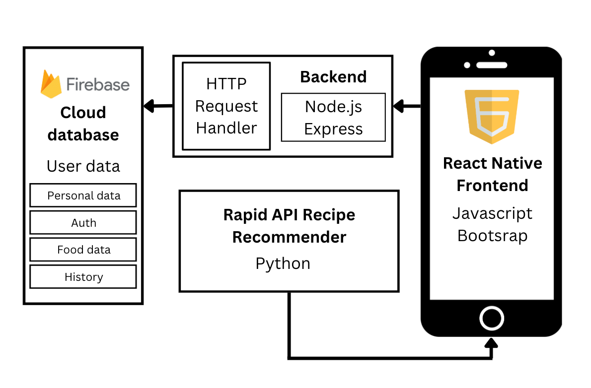

# SHELP - Team 11 Project: React Native Mobile App

## Team Members
- Siya Choudhary: worked on database set-up & management + UI
- Claire Lin : worked on authentication & backend + UI
- Shriya Mandalapu: worked on recipe generator integration
- Aliya Ahmad: worked on authentication & backend + UI

# Introduction

Have you ever found yourself throwing out tons of food from your pantry? Shelp is here to help! Our app helps reduce food waste by managing pantry items and sending timely alerts before they expire.

What can Shelp help with: 
- Add items to your virtual pantry
- Organize pantry items by expiration date, from closest to furthest
- Receive alerts when your pantry items are expiring
- Remove and clean up your pantry
- AI-generated recipe suggestions based on items close to expiring

# Technical Architecture

Database Storage:

- We use Firebase for simple, scalable cloud storage and integrated user authentication.
- Each user is represented as a unique token, storing basic information (name, password, email) and pantry data.

Frontend:
- Built with React Native for cross-platform support, focusing on iOS and Android usage.
- Uses JavaScript and the Bootstrap library for efficient, responsive design.

Backend:
- Leverages Firebase for real-time data storage.



This is a new [**React Native**](https://reactnative.dev) project, bootstrapped using [`@react-native-community/cli`](https://github.com/react-native-community/cli).

# Getting Started With Development

> **Note**: Make sure you have completed the [Set Up Your Environment](https://reactnative.dev/docs/set-up-your-environment) guide before proceeding.

## Step 1: Start Metro

First, you will need to run **Metro**, the JavaScript build tool for React Native.

To start the Metro dev server, run the following command from the root of your React Native project:

```sh
# Using npm
npm start

# OR using Yarn
yarn start
```

## Step 2: Build and run your app

With Metro running, open a new terminal window/pane from the root of your React Native project, and use one of the following commands to build and run your Android or iOS app:

### Android

```sh
# Using npm
npm run android

# OR using Yarn
yarn android
```

### iOS

For iOS, remember to install CocoaPods dependencies (this only needs to be run on first clone or after updating native deps).

The first time you create a new project, run the Ruby bundler to install CocoaPods itself:

```sh
bundle install
```

Then, and every time you update your native dependencies, run:

```sh
bundle exec pod install
```

For more information, please visit [CocoaPods Getting Started guide](https://guides.cocoapods.org/using/getting-started.html).

```sh
# Using npm
npm run ios

# OR using Yarn
yarn ios
```

If everything is set up correctly, you should see your new app running in the Android Emulator, iOS Simulator, or your connected device.

This is one way to run your app — you can also build it directly from Android Studio or Xcode.

## Step 3: Modify your app

Now that you have successfully run the app, let's make changes!

Open `App.tsx` in your text editor of choice and make some changes. When you save, your app will automatically update and reflect these changes — this is powered by [Fast Refresh](https://reactnative.dev/docs/fast-refresh).

When you want to forcefully reload, for example to reset the state of your app, you can perform a full reload:

- **Android**: Press the <kbd>R</kbd> key twice or select **"Reload"** from the **Dev Menu**, accessed via <kbd>Ctrl</kbd> + <kbd>M</kbd> (Windows/Linux) or <kbd>Cmd ⌘</kbd> + <kbd>M</kbd> (macOS).
- **iOS**: Press <kbd>R</kbd> in iOS Simulator.

## Congratulations! :tada:

You've successfully run and modified your React Native App. :partying_face:

### Now what?

- If you want to add this new React Native code to an existing application, check out the [Integration guide](https://reactnative.dev/docs/integration-with-existing-apps).
- If you're curious to learn more about React Native, check out the [docs](https://reactnative.dev/docs/getting-started).

# Troubleshooting

If you're having issues getting the above steps to work, see the [Troubleshooting](https://reactnative.dev/docs/troubleshooting) page.
